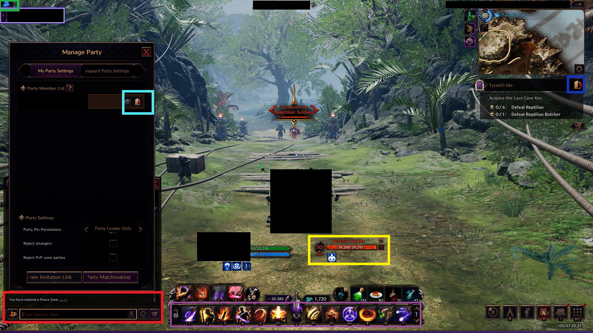
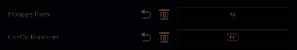

  <a href="#key-features">Installation</a> •
  <a href="#screenshots">Screenshots</a> •
  <a href="#technology">Technology</a> •
  <a href="#how-to-use">How To Use</a> 

## Installation

* [Tesseract-OCR](https://github.com/UB-Mannheim/tesseract/wiki) 
  * Create a folder: 'C:\Tesseract-OCR' and install the Tesseract-OCR in that folder  
 
* [Python](https://www.python.org/downloads/)
  * Install Python. You do not need change any installation settings 
 
* [PyCharm](https://www.jetbrains.com/pycharm/download/?section=windows) 
  * Ensure you are selecting the Community Edition. On the website, scroll down, and you'll be able to locate the correct version 
  * Install PyCharm. You do not need change any installation settings 
   

* Github - I will send you a link where you will download a <b>zip file</b>.
  * Click 'Code', and then click 'Download as ZIP' 
   

### Setup
  * Start up PyCharm. You will be prompted to create a new project. Simply accept the preset settings
  * This will create this directory: PyCharmProjects\PythonProject in your user folder.
    * Example, 'C:\Users\JohnSmith\PyCharmProjects\PythonProject'
  * Extract the <b>zip file</b> into the PyCharmProjects\PythonProject folder that was created above
  * In PyCharm, verify extracted zip folder in the left-side project directory
  * In PyCharm, on the bottom left, look for the 'terminal' icon  and click it to open a terminal
  * In the terminal, type:
    * pip install -r throne_script-main-<your name>\requirements.txt
  * After the installation is done, double-click the python file in the project directory:
    * throne_script_polish_crystal_dungeon.py
  * On the top right, press the green arrow button to run the script

## Screenshots
The script has specific display requirements. I will need 2 or more specific screenshots of your screen. 
Depending on your setup, I may ask for more, and it might require HUD adjustments to meet requirements. 
### Screenshot 1
See the example and replicate this screenshot 
 
Enter Tyrant's Isle and the ensure following is shown:
 * An active target
 * Exit dungeon button
 * Active (as in press enter and able to type) chat box
   * Note: Create one tab that has every filter turned off except for 'System' and 'Items'
 * Manage Party button
 * Manage Party display
   * Note: if this display is blocking something on this list, take another screenshot with the Manage Party display alone 
 * Active Skills (able to cast/use)
   * Note:
   * It is ideal to set your skill keybindings to a single keyboard key
   * If it is set to a mouse thumb button, does not work
   * We will discuss more about this

### Screenshot 2
Open up the Co-Op dungeon menu and take a screen

## Miscellaneous Settings
* Enable 'Auto-Move within Range to Attack Target' 

* Enable 'Aimed Skills Lock-on to Current Target' 

* Set a keybind to the Co-Op dungeon (preferably F11)  
* 